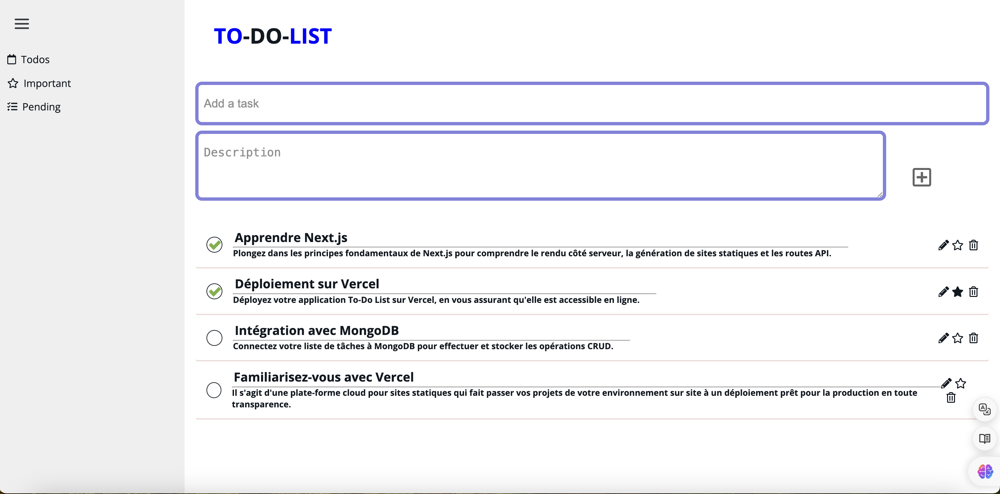
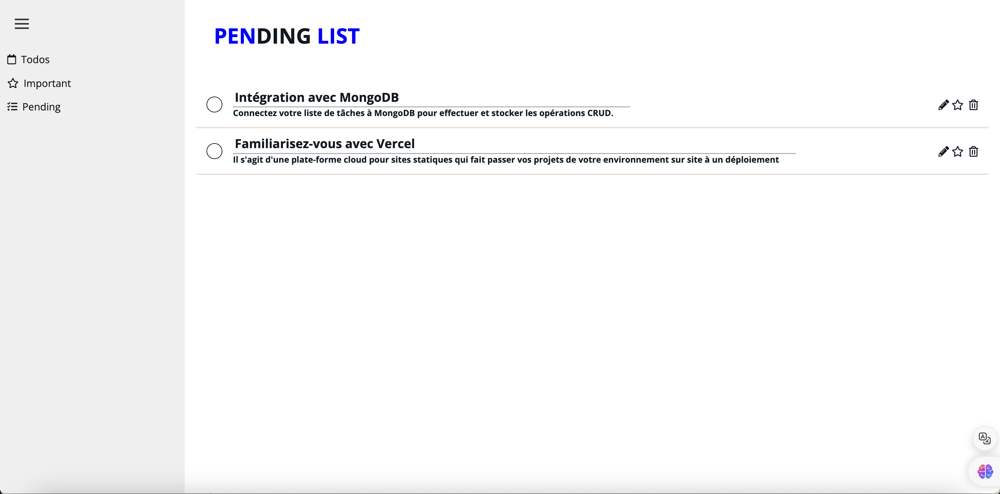
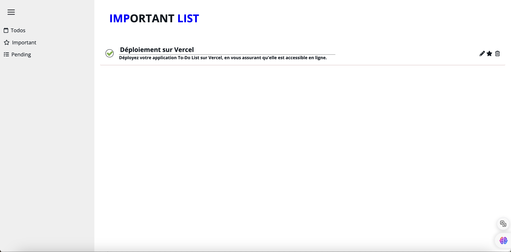

# [APPLICATION DE LISTE DE TÂCHES](https://to-do-list-pink-eight-43.vercel.app/)

#### * Homepage


#### * Pendinglist


#### * Important list


<!-- À PROPOS DU PROJET -->
## À Propos Du Projet

### Construit Avec

* [Next.js](https://nextjs.org/)
* [Mongodb](https://mongodb.com/)

<!-- POUR COMMENCER -->
## Pour Commencer

Ceci est un exemple de comment vous pourriez donner des instructions pour configurer votre projet localement.
Pour obtenir une copie locale opérationnelle, suivez ces étapes simples.

### Prérequis

Ceci est un exemple de comment lister les choses dont vous avez besoin pour utiliser le logiciel et comment les installer.

* nodejs >= 14.17.6
* yarn = dernière version

### Installation

1. Clonez le dépôt
   ```sh
   git clone https://github.com/KartikKARTIK-4498/To_do_list.git
   ```
2. Installez les paquets tiers
   ```sh
   yarn install
   ```

3. Entrez votre uri mongodb dans un fichier d'environnement dans le répertoire racine.
   ```env
   MONGODB_URI = votre uri mongodb
   ```
   
4. Démarrez l'application dans un serveur de développement
   ```sh
   yarn dev
   ```

### Membres Du Groupe :

* [Kartik KARTIK](https://www.linkedin.com/in/kartikkartik13/)
* [Chetana OLI](https://www.linkedin.com/in/chetana-oli-%E2%AD%90%EF%B8%8F-01a381188/)
* [Krishnaraj KONGANAPURAM CHIDAMBARAM](https://www.linkedin.com/in/krishnaraj-chidambaram-2291b9276/)
